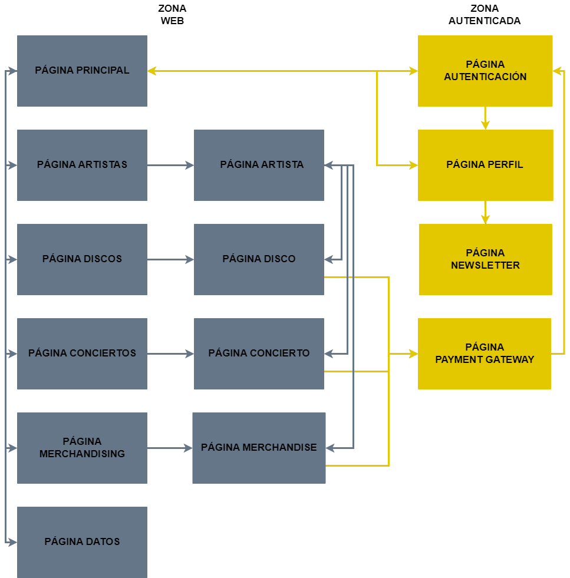

<br />
<div align="center">
  <a href="https://github.com/alu0101100586/APP-MERN-TFG">
    
  </a>

  <p align="center">
    Proyecto Final de Carrera del Grado en Ingeniería Informática
    <br />
    <a href="https://github.com/alu0101100586/APP-MERN-TFG/tree/main/Back-End"><strong>Explorar Back-End</strong></a>
    <br />
    <a href="https://github.com/alu0101100586/APP-MERN-TFG/tree/main/Front-End"><strong>Explorar Front-End</strong></a>
    <br />
    <a href="https://youtu.be/TqrupHoBEO0"><strong>Demo de la aplicación</strong></a>
  </p>
</div>


<details>
  <summary>Contenidos</summary>
  <ol>
    <li>
      <a href="#sobre-el-proyecto">Sobre El Proyecto</a>
      <ul>
        <li><a href="#tecnologías">Tecnologías</a></li>
      </ul>
    </li>
    <li>
      <a href="#inicialización">Inicialización</a>
      <ul>
        <li><a href="#clonación">Clonación</a></li>
        <li><a href="#instalación">Instalación</a></li>
      </ul>
    </li>
    <li><a href="#uso">Uso</a></li>
    <li><a href="#licencia">Licencia</a></li>
    <li><a href="#contacto">Contacto</a></li>
    <li><a href="#referencias">Referencias</a></li>
  </ol>
</details>


## Sobre El Proyecto

Los músicos emergentes en la industria musical a menudo se enfrentan a desafíos relacionados con la visibilidad y la financiación de sus proyectos. Esta problemática surge debido a la naturaleza altamente competitiva y saturada de la industria, lo que dificulta que muchos de estos músicos noveles logren que sus proyectos destaquen.

Se ha optado por desarrollar una aplicación web que se divide en dos áreas distintas. La primera es la zona web, accesible para cualquier persona, sin importar si están registradas en la aplicación o no. En esta sección, se encuentra una página principal que explica el propósito del proyecto, así como enlaces directos a los principales proyectos de crowdfunding, como discos, conciertos y merchandising. Además, se pueden explorar los distintos artistas y acceder a información detallada sobre ellos, incluyendo sus discos, conciertos y merchandising creados.

Por otro lado, también se puede acceder a todos los proyectos de manera separada, clasificados según sean discos, conciertos o merchandising. Al seleccionar un proyecto específico, se muestra información completa sobre el mismo, incluyendo su estado de financiamiento y el artista responsable de su creación. Además, se proporciona una página que recopila todos los datos de la aplicación, como el número de artistas y proyectos disponibles, junto con gráficos que muestran la cantidad de proyectos fallidos, en curso y exitosos.

La segunda zona de la aplicación, denominada zona de autenticación, requiere iniciar sesión para acceder. Sin embargo, se ha habilitado una página especial para el registro e inicio de sesión, que está disponible para todos los usuarios. Al registrarse, se pueden crear dos tipos diferentes de cuentas: usuarios comunes y artistas. Los usuarios comunes tienen la capacidad de administrar su participación en los proyectos, es decir, comprar o devolver productos. Por otro lado, los artistas tienen la posibilidad de crear, actualizar y eliminar cualquiera de sus proyectos, así como gestionar su página de artista, incluyendo la opción de eliminarla si así lo desean. Ambos tipos de usuarios tienen la capacidad de gestionar su cuenta personal, actualizando o eliminándola según sea necesario. Además, pueden modificar su contraseña y decidir si desean suscribirse o no a las noticias y actualizaciones de la aplicación.

<div align="center">
  
</div>

### Tecnologías

Para el desarrollo de la aplicación web se han usado una gran diversidad de tecnologías y paquetes, pero las más importantes son:

* [![MongoDB Atlas][MongoDB Atlas]][MongoDB Atlas-url]
* [![Express.js][Express.js]][Express.js-url]
* [![React.js][React.js]][React-url]
* [![Node.js][Node.js]][Node.js-url]
* [![JWT][JWT]][JWT-url]
* [![bcrypt][bcrypt]][bcrypt-url]
* [![Semantic UI React][Semantic UI React]][Semantic UI React-url]

## Inicialización
Para poder usar la aplicación web se recomienda usar la aplicación que está desplegada y es accesible desde [https://crowdsound.netlify.app](https://crowdsound.netlify.app)

### Clonación
En caso de que quiera desplegarla en local y probar diferentes cosas con la estructura y diseños actuales, se recomienda clonar este repositorio.
  ```sh
  git clone https://github.com/alu0101100586/APP-MERN-TFG.git
  ```

### Instalación

Una vez tenga el repositorio clonado, se debe tener en cuenta que debe realizar los mismos pasos para el Back-End como para el Front-End.

1. Instalación de yarn
   ```sh
   npm install --global yarn
   ```
2. Acceda a través de terminal a la carpeta que desee (Back-End o Front-End), por ejemplo:
   ```sh
   cd Back-End
   ```
3. Instale los paquetes
   ```sh
   yarn install
   ```
4. Ejecute la aplicación
   ```sh
   yarn run start
   ```

Tenga en cuenta que cuando se pueda usar la aplicación, se mostrará un mensaje por terminar que indique si el Back-end o el Front-end están listos para su uso.

## Uso
Para usar las diferentes API REST de las que disponen los sistemas definidos en el Back-End le recomendamos usar herramientas que faciliten esta tarea. Como por ejemplo:
* [![Postman][Postman]][Postman-url]
* [![Swagger][Swagger]][Swagger-url]
* [![Thunder Client][Thunder Client]][Thunder Client-url]

Para un uso del Front-End, le recomendamos que disponga de algún navegador en su ordenador y que ejecute tanto el el cliente (Front-End) como el servidor (Back-End) con los comandos mencionados en el apartado anterior.

## Licencia

<div align="center">
  
</div>

© Esta obra está bajo una licencia de Creative Commons Reconocimiento-NoComercial-CompartirIgual 4.0 Internacional.

## Contacto

Jonay Estévez Díaz - [alu0101100586@ull.edu.es](https://gmail.com)

Usuario de GitHub - [https://github.com/alu0101100586](https://github.com/alu0101100586)

Enlace del proyecto: [https://github.com/alu0101100586/APP-MERN-TFG](https://github.com/alu0101100586/APP-MERN-TFG)

## Referencias
* [NodeJs](https://nodejs.org/en/docs)
* [Express](https://expressjs.com/es/guide/routing.html)
* [Bcrypt](https://yarnpkg.com/package/bcrypt)
* [Multiparty](https://yarnpkg.com/package/connect-multiparty)
* [JWT](https://jwt.io)
* [Mongoose](https://mongoosejs.com)
* [Mongoose-Pagination](https://yarnpkg.com/package/mongoose-paginate)
* [React](https://es.react.dev/reference/react)
* [Semantic Ui React](https://react.semantic-ui.com)
* [React Router Dom](https://reactrouter.com/en/main)
* [React DropZone](https://react-dropzone.js.org)
* [React DatePicker](https://reactdatepicker.com)
* [React Chartjs 2](https://react-chartjs-2.js.org)
* [Leaflet](https://leafletjs.com)
* [Formik](https://formik.org)
* [Yup](https://yarnpkg.com/?q=yup&p=1)
* [Sass](https://sass-lang.com)

[React.js]: https://img.shields.io/badge/React-20232A?style=for-the-badge&logo=react&logoColor=61DAFB
[React-url]: https://reactjs.org/
[Node.js]: https://img.shields.io/badge/Node.js-43853D?style=for-the-badge&logo=node.js&logoColor=white
[Node.js-url]: https://nodejs.org/
[Express.js]: https://img.shields.io/badge/Express.js-000000?style=for-the-badge&logo=express&logoColor=white
[Express.js-url]: https://expressjs.com/
[JWT]: https://img.shields.io/badge/JWT-000000?style=for-the-badge&logo=json-web-tokens&logoColor=white
[JWT-url]: https://jwt.io/
[bcrypt]: https://img.shields.io/badge/bcrypt-000000?style=for-the-badge&logo=bcrypt&logoColor=white
[bcrypt-url]: https://www.npmjs.com/package/bcrypt
[MongoDB Atlas]: https://img.shields.io/badge/MongoDB%20Atlas-4DB33D?style=for-the-badge&logo=mongodb&logoColor=white
[MongoDB Atlas-url]: https://www.mongodb.com/cloud/atlas
[Semantic UI React]: https://img.shields.io/badge/Semantic%20UI%20React-35bdb2?style=for-the-badge&logo=semantic-ui-react&logoColor=white
[Semantic UI React-url]: https://react.semantic-ui.com/
[Postman]: https://img.shields.io/badge/Postman-FF6C37?style=for-the-badge&logo=postman&logoColor=white
[Postman-url]: https://www.postman.com/
[Thunder Client]: https://img.shields.io/badge/Thunder%20Client-FF481D?style=for-the-badge&logo=thunderclient&logoColor=white
[Thunder Client-url]: https://www.thunderclient.io/
[Swagger]: https://img.shields.io/badge/Swagger-85EA2D?style=for-the-badge&logo=swagger&logoColor=black
[Swagger-url]: https://swagger.io/

